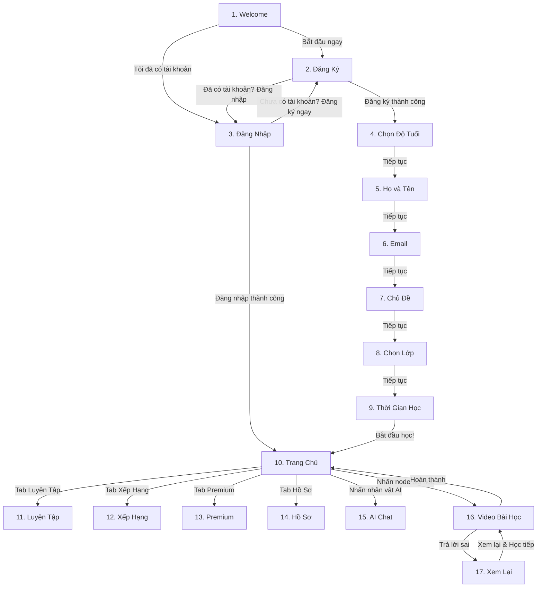
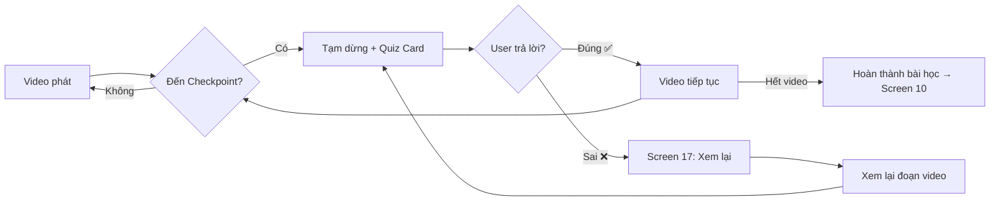

# History Alive — Luồng Hoạt Động App

## Tổng Quan

---

## Luồng A: Onboarding (Screens 1 → 9)

### Screen 1 — Welcome

| Thành phần | Tương tác | Chuyển đến |
|---|---|---|
| Nút **"Bắt đầu ngay →"** | Nhấn | → Screen 2 (Đăng Ký) |
| Link **"Tôi đã có tài khoản"** | Nhấn | → Screen 3 (Đăng Nhập) |

---

### Screen 2 — Đăng Ký

| Thành phần | Tương tác | Chuyển đến |
|---|---|---|
| Nút **"Tiếp tục với Google"** | Nhấn → OAuth Google | Thành công → Screen 4 |
| Nút **"Tiếp tục với Facebook"** | Nhấn → OAuth Facebook | Thành công → Screen 4 |
| Input **"Tên tài khoản"** | Nhập text | Lưu vào form |
| Input **"Mật khẩu"** | Nhập text, icon 👁️ toggle hiện/ẩn | Lưu vào form |
| Input **"Xác nhận mật khẩu"** | Nhập text | Validate khớp mật khẩu |
| Nút **"Đăng Ký"** | Nhấn → validate form | Thành công → Screen 4 |
| Link **"Đã có tài khoản? Đăng nhập"** | Nhấn | → Screen 3 |

> [!NOTE]
> Nếu đăng ký bằng Google/Facebook, bỏ qua bước nhập tên/mật khẩu thủ công.

---

### Screen 3 — Đăng Nhập

| Thành phần | Tương tác | Chuyển đến |
|---|---|---|
| Nút **"Tiếp tục với Google"** | Nhấn → OAuth | → Screen 10 (Trang Chủ) |
| Nút **"Tiếp tục với Facebook"** | Nhấn → OAuth | → Screen 10 |
| Input **"Tài khoản hoặc Email"** | Nhập text | Lưu vào form |
| Input **"Mật khẩu"** | Nhập text, icon 👁️ toggle | Lưu vào form |
| Link **"Quên mật khẩu?"** | Nhấn | → Popup reset mật khẩu |
| Nút **"Đăng Nhập"** | Nhấn → xác thực | Thành công → Screen 10 |
| Link **"Chưa có tài khoản? Đăng ký ngay"** | Nhấn | → Screen 2 |
| Nút **"←"** (Back) | Nhấn | → Screen 1 |

> [!IMPORTANT]
> User đăng nhập → bỏ qua toàn bộ onboarding (screens 4–9) → vào thẳng **Screen 10**.

---

### Screen 4 — Chọn Độ Tuổi
*Progress bar: 1/6*

| Thành phần | Tương tác | Chuyển đến |
|---|---|---|
| 4 thẻ tuổi: **6-10 / 11-14 / 15-18 / 18+** | Nhấn → highlight viền #fbce03 | Chọn 1 thẻ |
| Nút **"Tiếp tục"** | Nhấn (chỉ active khi đã chọn) | → Screen 5 |
| Nút **"←"** | Nhấn | → Screen 2 |

---

### Screen 5 — Họ và Tên
*Progress bar: 2/6*

| Thành phần | Tương tác | Chuyển đến |
|---|---|---|
| Input **"Họ"** | Nhập text | Lưu |
| Input **"Tên"** | Nhập text | Lưu |
| Nút **"Tiếp tục"** | Nhấn (active khi cả 2 field có data) | → Screen 6 |
| Nút **"←"** | Nhấn | → Screen 4 |

---

### Screen 6 — Email
*Progress bar: 3/6*

| Thành phần | Tương tác | Chuyển đến |
|---|---|---|
| Input **"Email"** | Nhập email, validate format | Lưu |
| Nút **"Tiếp tục"** | Nhấn (active khi email hợp lệ) | → Screen 7 |
| Nút **"←"** | Nhấn | → Screen 5 |

---

### Screen 7 — Khảo Sát Chủ Đề
*Progress bar: 4/6*

| Thành phần | Tương tác | Chuyển đến |
|---|---|---|
| Thẻ **"Lịch sử Việt Nam"** 🏛️ | Nhấn → highlight #fbce03 | Chọn |
| Thẻ **"Lịch sử Thế Giới"** 🌍 | Nhấn → highlight #fbce03 | Chọn |
| Nút **"Tiếp tục"** | Nhấn | → Screen 8 |
| Nút **"←"** | Nhấn | → Screen 6 |

> [!TIP]
> Có thể cho phép chọn cả 2 chủ đề (multi-select).

---

### Screen 8 — Chọn Lớp
*Progress bar: 5/6*

| Thành phần | Tương tác | Chuyển đến |
|---|---|---|
| Grid lớp: **Lớp 1–5** (nhóm Tiểu Học) | Nhấn 1 → highlight #fbce03 | Chọn |
| Grid lớp: **Lớp 6–9** (nhóm THCS) | Nhấn 1 → highlight | Chọn |
| Grid lớp: **Lớp 10–12** (nhóm THPT) | Nhấn 1 → highlight | Chọn |
| Nút **"Tiếp tục"** | Nhấn | → Screen 9 |
| Nút **"←"** | Nhấn | → Screen 7 |

---

### Screen 9 — Thời Gian Học Mỗi Ngày
*Progress bar: 6/6 (100%, glow)*

| Thành phần | Tương tác | Chuyển đến |
|---|---|---|
| 7 thẻ thời gian: **5 / 10 / 15 / 20 / 30 / 45 / 60 phút** | Nhấn 1 → highlight #fbce03 | Chọn |
| Nút **"Bắt đầu học! 🎉"** | Nhấn (celebratory animation) | → Screen 10 (Trang Chủ) |
| Nút **"←"** | Nhấn | → Screen 8 |

---

## Luồng B: App Chính (Screens 10 → 15)

### Bottom Navigation Bar (chung cho Screen 10–14)

| Tab | Icon | Nhấn → Chuyển đến |
|---|---|---|
| Tab 1 | 🗺️ Compass | → Screen 10 (Trang Chủ) |
| Tab 2 | ⚔️ Swords | → Screen 11 (Luyện Tập) |
| Tab 3 | 🏆 Trophy | → Screen 12 (Xếp Hạng) |
| Tab 4 | 💎 Diamond | → Screen 13 (Premium) |
| Tab 5 | 👤 Avatar | → Screen 14 (Hồ Sơ) |

---

### Screen 10 — Trang Chủ / Lộ Trình Học

| Thành phần | Tương tác | Chuyển đến |
|---|---|---|
| **Thanh năng lượng** ❤️❤️❤️🤍🤍 | Hiển thị "3/5", timer hồi phục | Chỉ xem |
| Nút **"+"** (bên cạnh hearts) | Nhấn | → Screen 13 (Premium) hoặc popup mua thêm |
| **Node bài học (active)** — vd "Khởi Nghĩa" | Nhấn | → Screen 16 (Video Bài Học) |
| **Node bài học (completed)** | Nhấn | → Screen 16 (xem lại) |
| **Node bài học (locked)** 🔒 | Nhấn | → Popup "Hoàn thành bài trước để mở khóa" |
| **Nhân vật AI** bên cạnh node (vd Trần Hưng Đạo) | Nhấn | → Screen 15 (AI Chat) |
| **Bubble "Chạm để hỏi ta!"** | Nhấn | → Screen 15 (AI Chat) |
| 🔥 Streak icon | Nhấn | → Popup thống kê streak |
| 💎 Gem/EXP icon | Nhấn | → Screen 13 (Premium) |

> [!IMPORTANT]
> Khi ❤️ hearts = 0/5, user KHÔNG THỂ vào bài học mới. Phải chờ hồi phục hoặc nâng cấp Premium.

---

### Screen 11 — Luyện Tập

| Thành phần | Tương tác | Chuyển đến |
|---|---|---|
| Banner **"Thử Thách Hàng Ngày"** ⚡ | Nhấn | → Màn hình Daily Challenge (quiz nhanh) |
| Thẻ **"Quiz Sấm Sét"** | Nhấn | → Màn hình Quiz (10 câu, 60s/câu) |
| Thẻ **"Dòng Thời Gian"** | Nhấn | → Màn hình kéo thả sự kiện |
| Thẻ **"Thách Đấu 1v1"** | Nhấn | → Tìm đối thủ → Màn hình đấu |
| Thẻ **"Giải Mã Ô Chữ"** | Nhấn | → Màn hình ô chữ lịch sử |
| Thẻ **"Ghi Nhớ Flashcard"** | Nhấn | → Màn hình lật thẻ |

---

### Screen 12 — Xếp Hạng

| Thành phần | Tương tác | Chuyển đến |
|---|---|---|
| **Podium Top 3** (avatar + tên) | Nhấn avatar | → Popup xem hồ sơ user |
| **Danh sách xếp hạng** (cuộn) | Cuộn lên/xuống | Xem thêm users |
| **Hàng rank của mình** (pinned ở dưới) | Chỉ xem | Highlight #fbce03 |

---

### Screen 13 — Premium

| Thành phần | Tương tác | Chuyển đến |
|---|---|---|
| **Pro Plan** card | Xem chi tiết | — |
| Tag **"Phổ biến nhất"** | Chỉ hiển thị | — |
| Nút **"Dùng thử miễn phí"** | Nhấn | → Luồng thanh toán → Kích hoạt trial 3 ngày |
| **Edu Plan** card | Xem chi tiết | — |
| Nút **"Liên hệ tư vấn"** | Nhấn | → Form liên hệ / email / Zalo |

> [!NOTE]
> Sau khi kích hoạt Premium: thanh ❤️ energy ẩn đi, mở khóa tất cả tính năng.

---

### Screen 14 — Hồ Sơ

| Thành phần | Tương tác | Chuyển đến |
|---|---|---|
| **Avatar** (khung #fbce03) | Nhấn | → Popup đổi avatar |
| Thẻ stat **"Chuỗi ngày"** 🔥 | Nhấn | → Popup chi tiết streak |
| Thẻ stat **"Tổng EXP"** ⭐ | Nhấn | → Popup lịch sử EXP |
| Thẻ stat **"Hạng"** 🏆 | Nhấn | → Screen 12 (Xếp Hạng) |
| Thẻ stat **"Thành tựu"** 🎖️ | Nhấn | → Màn hình danh sách thành tựu |
| Menu **"Chỉnh sửa hồ sơ"** | Nhấn | → Form sửa tên, email |
| Menu **"Đổi mật khẩu"** | Nhấn | → Form đổi mật khẩu |
| Menu **"Cài đặt thông báo"** | Nhấn | → Trang settings notification |
| Menu **"Ngôn ngữ"** | Nhấn | → Popup chọn ngôn ngữ |
| Menu **"Đăng xuất"** (đỏ) | Nhấn | → Popup xác nhận → Screen 1 |

---

### Screen 15 — AI Chat (Trò chuyện lịch sử)

| Thành phần | Tương tác | Chuyển đến |
|---|---|---|
| Nút **"←"** (Back) | Nhấn | → Screen 10 (Trang Chủ) |
| **Ảnh nhân vật** (Nguyễn Trãi) | Chỉ hiển thị | — |
| **Chat bubbles** | Cuộn lên/xuống đọc | — |
| Input **"Hỏi Nguyễn Trãi..."** | Nhấn → bàn phím hiện | Nhập câu hỏi |
| Nút **🎤 Mic** | Nhấn giữ | Nhập giọng nói → chuyển thành text |
| Nút **"➤" Gửi** (#fbce03) | Nhấn | Gửi câu hỏi → AI trả lời |

---

## Luồng C: Video Bài Học (Screens 16 → 17)

### Screen 16 — Video Bài Học + Quiz Checkpoint

| Thành phần | Tương tác | Chuyển đến |
|---|---|---|
| Nút **"←"** | Nhấn | → Popup "Bạn muốn thoát?" → Screen 10 |
| Nút **"✕"** | Nhấn | → Popup xác nhận → Screen 10 |
| **Video player** | Tự động phát | Video lịch sử |
| Nút **⏸️ Pause** | Nhấn | Tạm dừng video |
| Nút **▶️ Play** | Nhấn | Tiếp tục phát |
| **Thanh progress bar** | Kéo tua (nếu chưa bị khóa) | Tua video |
| **Checkpoint marker** (CP1/CP2/CP3) | Tự động kích hoạt khi video đến checkpoint | Video tạm dừng → Quiz Card hiện ra |
| **Quiz Card — 4 đáp án** | Nhấn 1 đáp án → highlight | Chọn câu trả lời |
| Nút **"Xác nhận & Tiếp tục ▶️"** | Nhấn | Đúng → video tiếp tục, Sai → Screen 17 |

---

### Screen 17 — Trả Lời Sai / Xem Lại

| Thành phần | Tương tác | Chuyển đến |
|---|---|---|
| Card **"Sai rồi! 😔"** | Chỉ hiển thị | — |
| **Đáp án sai** (đỏ ✗) | Chỉ hiển thị | — |
| **Đáp án đúng** (xanh ✅) | Chỉ hiển thị | — |
| **Ô giải thích** (beige) | Đọc lý giải | — |
| Banner **"Xem lại đoạn video này!"** | Chỉ hiển thị | — |
| Nút **"Xem lại & Học tiếp ▶️"** | Nhấn | → Screen 16 (tua về đoạn cần xem lại) |
| **Thanh tua 🔒** | Bị khóa, không tua được | User buộc phải xem hết đoạn |

> [!CAUTION]
> Thanh tua bị khóa cho đến khi user xem hết đoạn video liên quan. Sau khi xem xong → Quiz Card hiện lại → user trả lời lần nữa.

---

## Tóm Tắt Luồng Chính

| Hành trình | Flow |
|---|---|
| **User mới** | 1 → 2 → 4 → 5 → 6 → 7 → 8 → 9 → 10 |
| **User có tài khoản** | 1 → 3 → 10 |
| **Học bài** | 10 → 16 → (17 nếu sai) → 10 |
| **Chat AI** | 10 → 15 → 10 |
| **Luyện tập** | 10 → 11 → (quiz/game) → 11 |
| **Nâng cấp Premium** | 10/13 → thanh toán → mở khóa |
| **Đăng xuất** | 14 → xác nhận → 1 |
